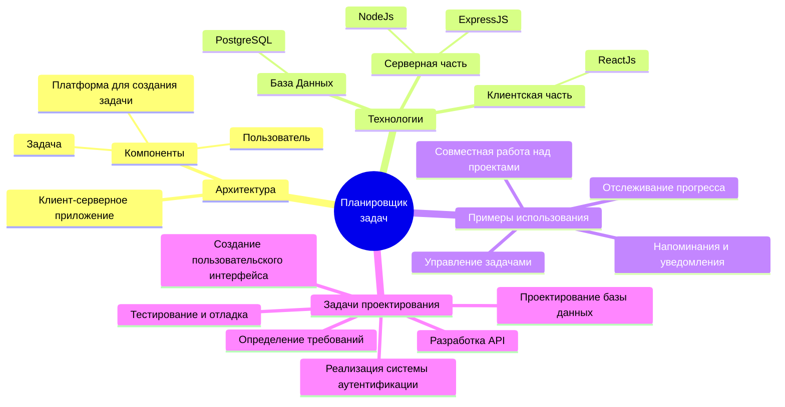
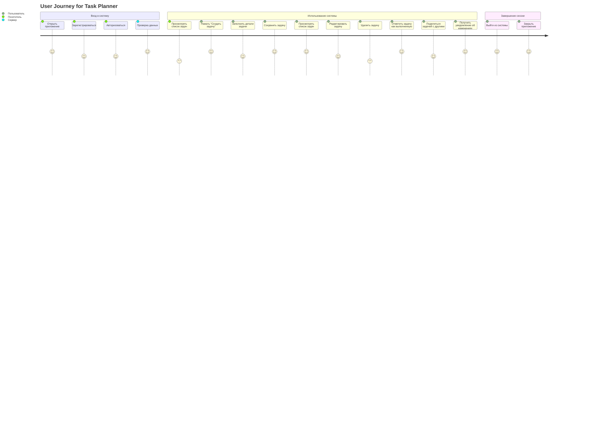

```mermaid
mindmap
  root((Планировщик
  задач))
    Архитектура
      Клиент-серверное приложение
      ::icon(fa fa-server)
      Компоненты
        Пользователь
        Платформа для создания задачи
        Задача
    Технологии
      Серверная часть
        NodeJs
        ExpressJS
      База Данных
        PostgreSQL
      Клиентская часть
        ReactJs
    Примеры использования
      Управление задачами
      Совместная работа над проектами
      Напоминания и уведомления
      Отслеживание прогресса
    Задачи проектирования
      Определение требований
      Проектирование базы данных
      Разработка API
      Создание пользовательского интерфейса
      Реализация системы аутентификации
      Тестирование и отладка
```

```mermaid
journey
    title User Journey for Task Planner
    section Вход в систему
      Открыть приложение: 5: Посетитель
      Зарегистрироваться: 4: Посетитель
      Авторизоваться: 4: Посетитель
      Проверка данных: 5: Сервер
    
    section Использование системы
      Просмотреть список задач: 3: Посетитель
      Нажать "Создать задачу": 5: Пользователь
      Заполнить детали задачи: 4: Пользователь
      Сохранить задачу: 5: Пользователь
      Просмотреть список задач: 5: Пользователь
      Редактировать задачу: 4: Пользователь
      Удалить задачу: 3: Пользователь
      Отметить задачу как выполненную: 5: Пользователь
      Поделиться задачей с другими: 4: Пользователь
      Получить уведомление об изменениях: 5: Пользователь

    section Завершение сессии
      Выйти из системы: 5: Пользователь
      Закрыть приложение: 5: Пользователь
```

