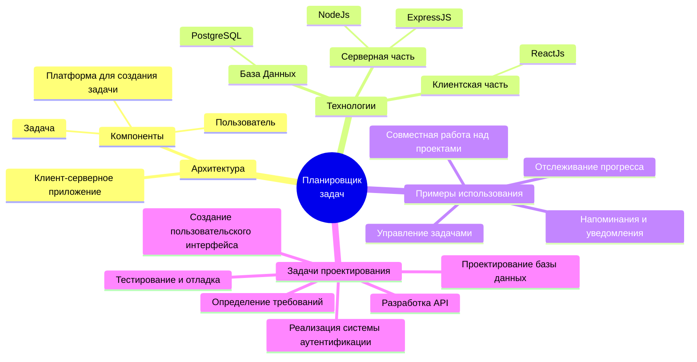

```mermaid
mindmap
  root((Планировщик
  задач))
    Архитектура
      Клиент-серверное приложение
      ::icon(fa fa-server)
      Компоненты
        Пользователь
        Платформа для создания задачи
        Задача
    Технологии
      Серверная часть
        NodeJs
        ExpressJS
      База Данных
        PostgreSQL
      Клиентская часть
        ReactJs
    Примеры использования
      Управление задачами
      Совместная работа над проектами
      Напоминания и уведомления
      Отслеживание прогресса
    Задачи проектирования
      Определение требований
      Проектирование базы данных
      Разработка API
      Создание пользовательского интерфейса
      Реализация системы аутентификации
      Тестирование и отладка
```
