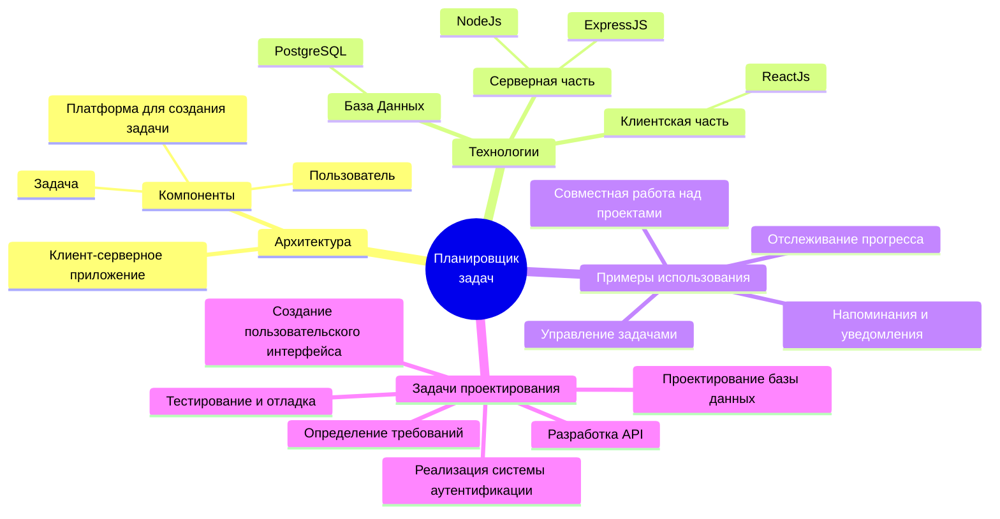
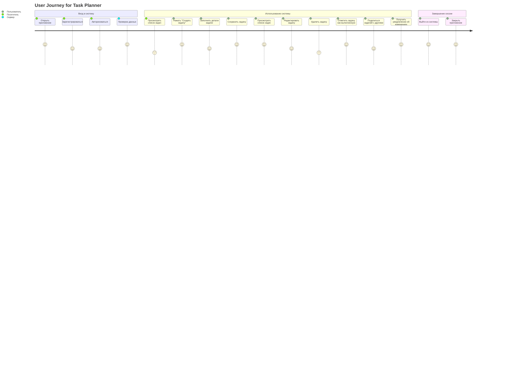
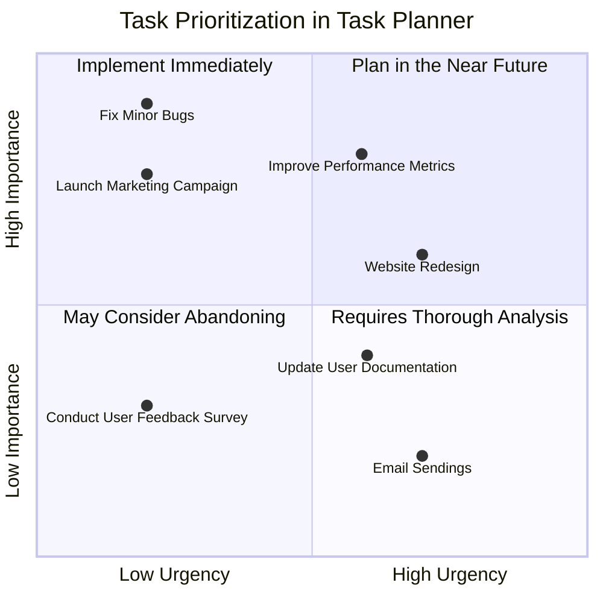
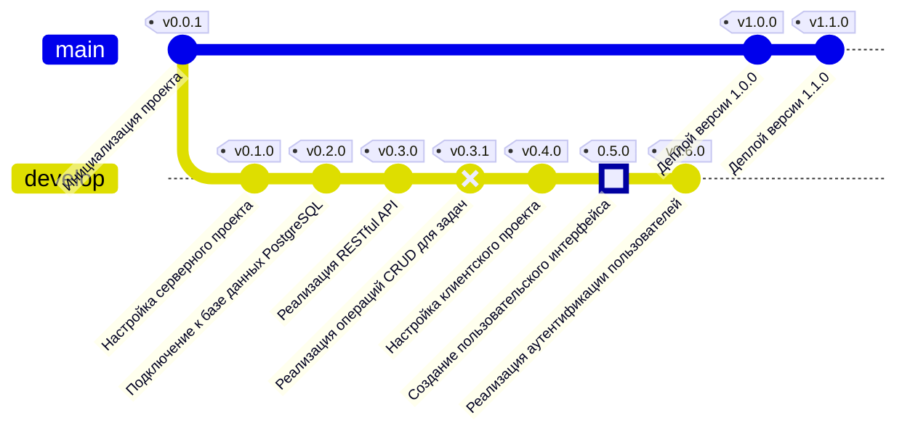

```mermaid
mindmap
  root((Планировщик
  задач))
    Архитектура
      Клиент-серверное приложение
      ::icon(fa fa-server)
      Компоненты
        Пользователь
        Платформа для создания задачи
        Задача
    Технологии
      Серверная часть
        NodeJs
        ExpressJS
      База Данных
        PostgreSQL
      Клиентская часть
        ReactJs
    Примеры использования
      Управление задачами
      Совместная работа над проектами
      Напоминания и уведомления
      Отслеживание прогресса
    Задачи проектирования
      Определение требований
      Проектирование базы данных
      Разработка API
      Создание пользовательского интерфейса
      Реализация системы аутентификации
      Тестирование и отладка
```

```mermaid
journey
    title User Journey for Task Planner
    section Вход в систему
      Открыть приложение: 5: Посетитель
      Зарегистрироваться: 4: Посетитель
      Авторизоваться: 4: Посетитель
      Проверка данных: 5: Сервер
    
    section Использование системы
      Просмотреть список задач: 3: Посетитель
      Нажать "Создать задачу": 5: Пользователь
      Заполнить детали задачи: 4: Пользователь
      Сохранить задачу: 5: Пользователь
      Просмотреть список задач: 5: Пользователь
      Редактировать задачу: 4: Пользователь
      Удалить задачу: 3: Пользователь
      Отметить задачу как выполненную: 5: Пользователь
      Поделиться задачей с другими: 4: Пользователь
      Получить уведомление об изменениях: 5: Пользователь

    section Завершение сессии
      Выйти из системы: 5: Пользователь
      Закрыть приложение: 5: Пользователь
```

```mermaid
quadrantChart
    title Task Prioritization in Task Planner
    x-axis Low Urgency --> High Urgency
    y-axis Low Importance --> High Importance
    quadrant-1 Plan in the Near Future
    quadrant-2 Implement Immediately
    quadrant-3 May Consider Abandoning
    quadrant-4 Requires Thorough Analysis
    Website Redesign: [0.7, 0.6]
    Launch Marketing Campaign: [0.2, 0.76]
    Update User Documentation: [0.6, 0.4]
    Fix Minor Bugs: [0.2, 0.9]
    Email Sendings: [0.7, 0.2]
    Conduct User Feedback Survey: [0.2, 0.3]
    Improve Performance Metrics: [0.59, 0.8]
```

```mermaid
gitGraph
  commit id: "Инициализация проекта" tag: "v0.0.1"
  branch develop
  commit id: "Настройка серверного проекта" tag: "v0.1.0"
  commit id: "Подключение к базе данных PostgreSQL" tag: "v0.2.0"
  commit id: "Реализация RESTful API" tag: "v0.3.0"
  commit id: "Реализация операций CRUD для задач" type: REVERSE tag: "v0.3.1"
  commit id: "Настройка клиентского проекта" tag: "v0.4.0"
  commit id: "Создание пользовательского интерфейса" type: HIGHLIGHT tag: "0.5.0"
  commit id: "Реализация аутентификации пользователей" tag: "v0.6.0"
  checkout main
  commit id: "Деплой версии 1.0.0" tag: "v1.0.0"
  commit id: "Деплой версии 1.1.0" tag: "v1.1.0"
```
